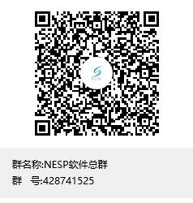

# NespAndroidSdkSample

Tip: if you want to develop an Android app that is similar to iOS, you can use SmoothDesign within NespAndroidSdk.

## To See：https://github.com/nespjin/nesp-sdk-android/

## QQ Group: 

